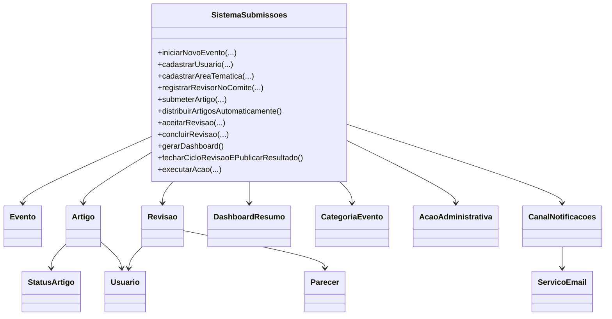

# PaperFlow

Sistema de submissao e avaliacao de artigos cientificos para eventos academicos.

## Escopo por pessoa

### Pessoa 1 - Nucleo do sistema

- cadastrar usuarios;
- cadastrar areas tematicas;
- iniciar novo evento;
- definir nome, cidade, periodo e prazo de submissao;
- controlar abertura e fechamento de submissao;
- receber artigo com nome, resumo e coautores;
- validar envio dentro do prazo;
- guardar artigos com status inicial de submetido.

### Pessoa 2 - Revisao e saida

- registrar e organizar revisores;
- montar comite tecnico;
- distribuir artigos automaticamente;
- respeitar afinidade de tema e conflito de interesse;
- aceitar e concluir revisao;
- salvar parecer com contribuicao, critica e veredito;
- exibir dashboard com indicadores;
- enviar e-mail para revisores e autores;
- fechar ciclo com aceite ou rejeicao.

## Estrutura de pacotes

```text
src/
  paperflow/
    Main.java
    aplicacao/
      SistemaSubmissoes.java
      acoes/
        AcaoAdministrativa.java
        AcaoCancelarDistribuicao.java
        AcaoReabrirSubmissao.java
        AcaoReenviarNotificacoes.java
        AcaoAprovarPublicacaoFinal.java
    dominio/
      Artigo.java
      Evento.java
      Revisao.java
      Parecer.java
      Usuario.java
      DashboardResumo.java
      Status*.java
      categoria/
        CategoriaEvento.java
        CategoriaFullPaper.java
        CategoriaShortPaper.java
        CategoriaDemo.java
    infra/
      notificacao/
        CanalNotificacoes.java
        OuvinteEmail.java
        MensagemNotificacao.java
        Gerador*.java
        Corpo*.java
        ServicoEmail.java
        ServicoEmailMemoria.java
```

## Mapeamento de requisitos

- RF01-RF05: cadastro, evento, submissao e validacoes no classe principal da aplicacao.
- RF06: distribuicao automatica considerando afinidade, carga e conflito de interesse.
- RF07: aceite e conclusao de revisao com registro de parecer.
- RF08: dashboard consolidado de artigos, revisores, avaliados e pendencias.
- RF09: envio de notificacoes para revisores e autores.
- RF10: acoes administrativas encapsuladas para operacoes de controle.

## Diagrama de classes (resumo)



## Execucao (Windows - cmd)

1. Gerar lista de fontes

```bat
dir /s /b src\paperflow\*.java > sources.txt
```

2. Compilar

```bat
rmdir /s /q out 2>nul
mkdir out
javac -d out @sources.txt
```

3. Executar simulacao

```bat
java -cp out paperflow.Main
```

## Cenario demonstrado no Main

1. cadastro de usuarios e areas;
2. abertura do evento;
3. composicao do comite tecnico;
4. submissao de artigos;
5. distribuicao automatica;
6. aceite e conclusao das revisoes;
7. geracao de dashboard;
8. fechamento do ciclo com resultado final;
9. exibicao dos e-mails enviados.
