# Diagramas UML - PaperFlow

Documentação detalhada dos diagramas UML do sistema PaperFlow, incluindo arquitetura geral e padrões de design específicos.

---

## 📐 Diagrama Geral de Classes (Principal)

```mermaid
classDiagram
    %% ===== APLICAÇÃO =====
    class SistemaSubmissoes {
        -eventos: Map
        -usuarios: Map
        -artigos: Map
        -revisores: Set
        -cargaPorRevisor: Map
        -canalNotificacoes: CanalNotificacao
        -servicoEmail: ServicoEmail
        -emailsEnviados: List
        +iniciarNovoEvento(...)
        +cadastrarUsuario(...)
        +cadastrarAreaTematica(...)
        +registrarRevisorNoComite(...)
        +submeterArtigo(...)
        +distribuirArtigosAutomaticamente()
        +aceitarRevisao(...)
        +concluirRevisao(...)
        +gerarDashboard()
        +fecharCicloRevisaoEPublicarResultado()
        +executarAcao(AcaoAdministrativa)
        +enviarEmail(...)
    }

    class AcaoAdministrativa {
        <<interface>>
        +executar()
        +descricao()
    }

    class AcaoReabrirSubmissao {
        +executar()
        +descricao()
    }

    class AcaoCancelarDistribuicao {
        +executar()
        +descricao()
    }

    class AcaoReenviarNotificacoes {
        -artigoId: String
        +executar()
        +descricao()
    }

    class AcaoAprovarPublicacaoFinal {
        -artigoId: String
        +executar()
        +descricao()
    }

    %% ===== DOMÍNIO =====
    class Usuario {
        -email: String
        -senha: String
        -instituicao: String
        -especialidades: Set
        +getEmail()
        +getSenha()
        +getInstituicao()
        +getEspecialidades()
    }

    class Evento {
        -nome: String
        -cidade: String
        -periodo: String
        -prazoSubmissao: LocalDateTime
        -areasTematicas: Set
        -aberto: boolean
        -categoria: CategoriaEvento
        +estaAberto(): boolean
        +getNome()
        +getCategoria()
    }

    class Artigo {
        -id: String
        -titulo: String
        -resumo: String
        -autor: Usuario
        -coautores: List
        -areasTematicas: Set
        -status: StatusArtigo
        -revisoes: List
        +getId()
        +getTitulo()
        +getAutor()
        +mudarStatus(StatusArtigo)
        +addRevisao(Revisao)
    }

    class Builder {
        -id: String
        -titulo: String
        +build(): Artigo
    }

    class Revisao {
        -artigo: Artigo
        -revisor: Usuario
        -estado: EstadoRevisao
        -parecer: Parecer
        +aceitarRevisao()
        +concluirRevisao(Parecer)
        +getEstado()
        +getParecer()
    }

    class Parecer {
        -contribuicao: String
        -critica: String
        -veredito: Veredito
        +getVeredito()
        +getVeredito().getScore(): int
    }

    class Veredito {
        <<enumeration>>
        ACEITO(4)
        FRACAMENTE_ACEITO(3)
        FRACAMENTE_REJEITADO(2)
        REJEITADO(1)
        -score: int
        +getScore(): int
    }

    class StatusArtigo {
        <<interface>>
        +getNome(): String
    }

    class StatusSubmetido {
        +getNome(): String
    }

    class StatusEmRevisao {
        +getNome(): String
    }

    class StatusAceito {
        +getNome(): String
    }

    class StatusRejeitado {
        +getNome(): String
    }

    class DashboardResumo {
        -totalArtigos: int
        -totalRevisores: int
        -totalArtigosAvaliados: int
        -totalPendentes: int
        -pendencias: List
        +getTotalArtigos()
        +getTotalRevisores()
        +getPendencias()
    }

    class EstadoRevisao {
        <<enumeration>>
        PENDENTE
        ACEITA
        CONCLUIDA
    }

    %% ===== CATEGORIA (STRATEGY) =====
    class CategoriaEvento {
        <<interface>>
        +getNomeCategoria(): String
    }

    class CategoriaFullPaper {
        +getNomeCategoria(): String
    }

    class CategoriaShortPaper {
        +getNomeCategoria(): String
    }

    class CategoriaDemo {
        +getNomeCategoria(): String
    }

    %% ===== NOTIFICAÇÕES (INFRASTRUCTURE) =====
    class ServicoEmail {
        <<interface>>
        +enviar(String, String, String)
    }

    class ServicoEmailSmtp {
        -host: String
        -porta: int
        -usuario: String
        -senha: String
        +enviar(String, String, String)
        +deMeioAmbiente(): ServicoEmailSmtp
    }

    class ServicoEmailMemoria {
        -emails: List
        +enviar(String, String, String)
    }

    class Email {
        -destinatario: String
        -assunto: String
        -corpo: String
        +getDestinatario()
        +getAssunto()
        +getCorpo()
    }

    class EmailBuilder {
        +paraDestinatario(String)
        +comAssunto(String)
        +comCorpo(String)
        +build(): Email
    }

    class CanalNotificacao {
        <<interface>>
        +notificar(MensagemNotificacao)
        +adicionarOuvinte(OuvinteNotificacao)
        +removerOuvinte(OuvinteNotificacao)
    }

    class CanalNotificacoes {
        -ouvintes: List
        +notificar(MensagemNotificacao)
        +adicionarOuvinte(OuvinteNotificacao)
        +removerOuvinte(OuvinteNotificacao)
    }

    class OuvinteNotificacao {
        <<interface>>
        +aoReceberNotificacao(MensagemNotificacao)
    }

    class OuvinteEmail {
        -servicoEmail: ServicoEmail
        +aoReceberNotificacao(MensagemNotificacao)
    }

    class MensagemNotificacao {
        -tipo: TipoNotificacao
        -destinatario: String
        -assunto: String
        -corpo: String
    }

    class TipoNotificacao {
        <<enumeration>>
        CONVITE_REVISAO
        RESULTADO_AUTOR
    }

    class GeradorEmail {
        <<abstract>>
        #servicoEmail: ServicoEmail
        +gerar(MensagemNotificacao)
        #montarCorpoEmail(): CorpoEmail
    }

    class GeradorConviteRevisao {
        +gerar(MensagemNotificacao)
        #montarCorpoEmail(): CorpoEmail
    }

    class GeradorResultadoAutor {
        +gerar(MensagemNotificacao)
        #montarCorpoEmail(): CorpoEmail
    }

    class CorpoEmailBase {
        <<abstract>>
        +gerarCorpo(): String
        #gerarCabecalho(): String
        #gerarRodape(): String
        #gerarConteudo(): String
    }

    class CorpoConviteRevisao {
        +gerarCorpo(): String
        #gerarConteudo(): String
    }

    class CorpoResultadoAutor {
        +gerarCorpo(): String
        #gerarConteudo(): String
    }

    %% ===== RELACIONAMENTOS =====
    
    %% SistemaSubmissoes relationships
    SistemaSubmissoes --> Evento : "utiliza"
    SistemaSubmissoes --> Usuario : "gerencia"
    SistemaSubmissoes --> Artigo : "gerencia"
    SistemaSubmissoes --> Revisao : "cria"
    SistemaSubmissoes --> CanalNotificacao : "usa"
    SistemaSubmissoes --> ServicoEmail : "injeta"
    SistemaSubmissoes --> AcaoAdministrativa : "executa"
    SistemaSubmissoes --> Email : "armazena"
    
    %% AcaoAdministrativa implementations
    AcaoAdministrativa <|.. AcaoReabrirSubmissao
    AcaoAdministrativa <|.. AcaoCancelarDistribuicao
    AcaoAdministrativa <|.. AcaoReenviarNotificacoes
    AcaoAdministrativa <|.. AcaoAprovarPublicacaoFinal

    %% Artigo relationships
    Artigo --> Usuario : "tem autor"
    Artigo --> StatusArtigo : "tem"
    Artigo --> Revisao : "recebe"
    Artigo --> "Artigo.Builder" : "criado por"
    
    %% Revisao relationships
    Revisao --> Usuario : "tem revisor"
    Revisao --> Parecer : "tem"
    Revisao --> EstadoRevisao : "tem estado"
    
    %% Parecer relationships
    Parecer --> Veredito : "tem"

    %% Evento relationships
    Evento --> CategoriaEvento : "usa"

    %% Strategy pattern
    CategoriaEvento <|.. CategoriaFullPaper
    CategoriaEvento <|.. CategoriaShortPaper
    CategoriaEvento <|.. CategoriaDemo

    %% State pattern
    StatusArtigo <|.. StatusSubmetido
    StatusArtigo <|.. StatusEmRevisao
    StatusArtigo <|.. StatusAceito
    StatusArtigo <|.. StatusRejeitado

    %% Email
    Email --> "Email.Builder" : "criado por"

    %% Observer pattern
    CanalNotificacao <|.. CanalNotificacoes
    OuvinteNotificacao <|.. OuvinteEmail
    CanalNotificacoes --> OuvinteNotificacao : "notifica"
    OuvinteEmail --> ServicoEmail : "usa"
    
    %% Template Method pattern
    GeradorEmail <|-- GeradorConviteRevisao
    GeradorEmail <|-- GeradorResultadoAutor
    GeradorEmail --> CorpoEmailBase : "cria"
    CorpoEmailBase <|-- CorpoConviteRevisao
    CorpoEmailBase <|-- CorpoResultadoAutor

    %% Service implementations
    ServicoEmail <|.. ServicoEmailSmtp
    ServicoEmail <|.. ServicoEmailMemoria
```

---

## 🎨 Padrão: STRATEGY - CategoriaEvento

Permite selecionar o tipo de evento em tempo de execução sem modificar o código cliente.

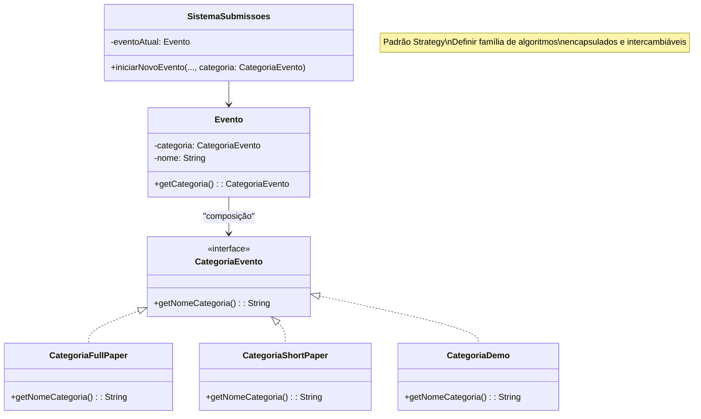

---

## 🔄 Padrão: STATE - StatusArtigo

Define transições de estado do artigo durante seu ciclo de vida.

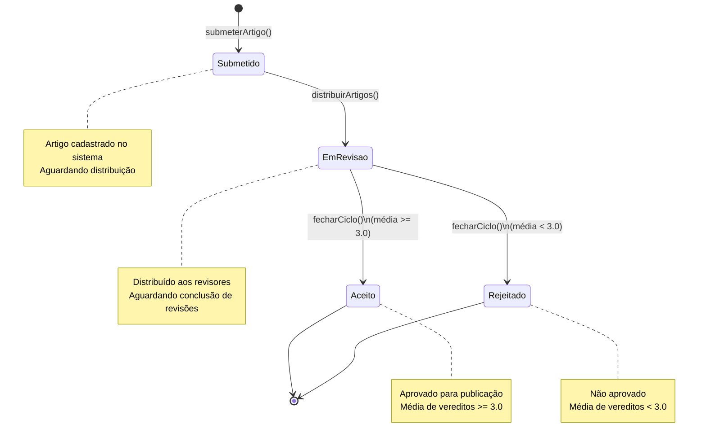

**Implementação em Código:**
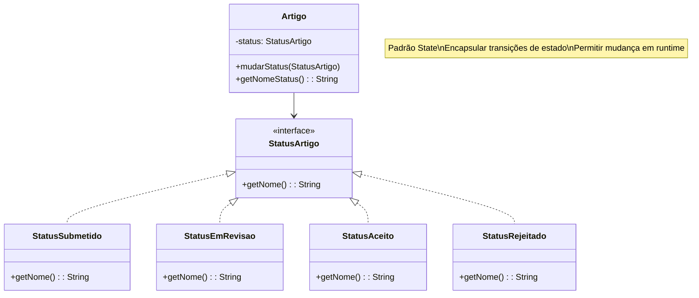

---

## 👁️ Padrão: OBSERVER - CanalNotificacoes

Implementa notificação desacoplada: quando um evento ocorre, todos os interessados são notificados.

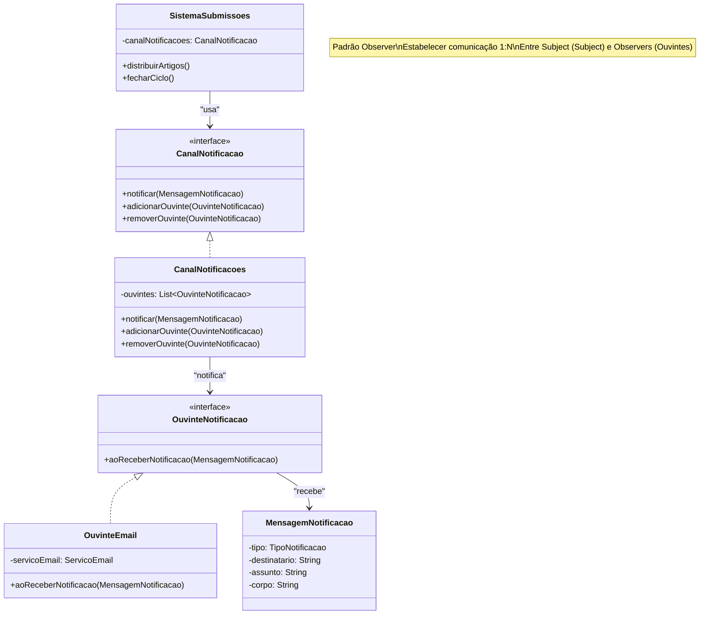

---

## ⚙️ Padrão: COMMAND - AcaoAdministrativa

Encapsula operações administrativas como objetos, permitindo fila, log e desfazer.

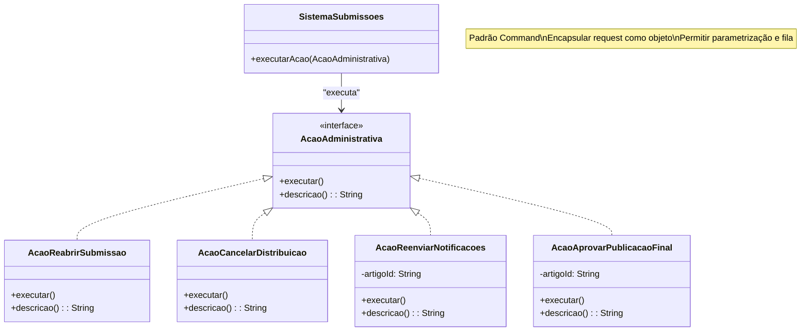

---

## 🏗️ Padrão: TEMPLATE METHOD - GeradorEmail

Define estrutura comum para geração de emails, deixando detalhes para subclasses.

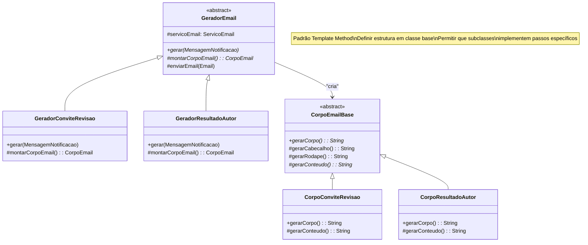

---

## 🏭 Padrão: BUILDER - Artigo

Constrói objetos complexos passo a passo, garantindo validação.

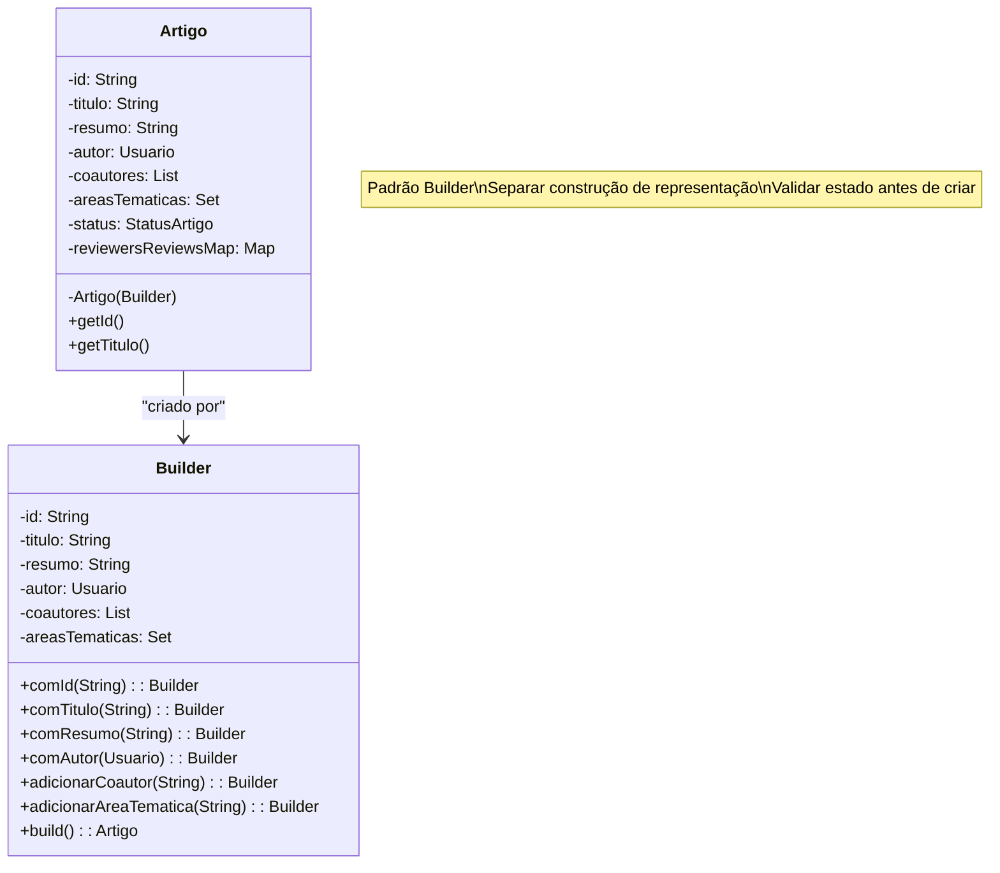

---

## 🛑 Padrão: FACADE - SistemaSubmissoes

Oferece interface unificada para subsistema complexo.

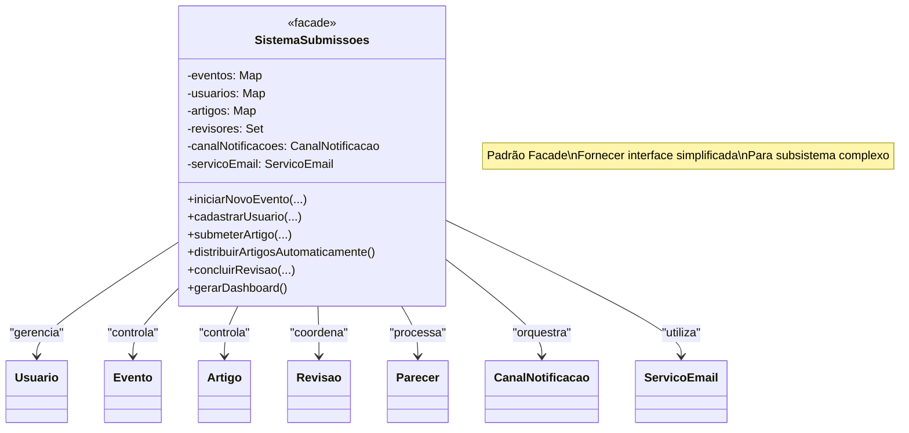

---

## 🔌 Padrão: STRATEGY - ServicoEmail

Permite trocar implementação de email sem alterar código cliente.

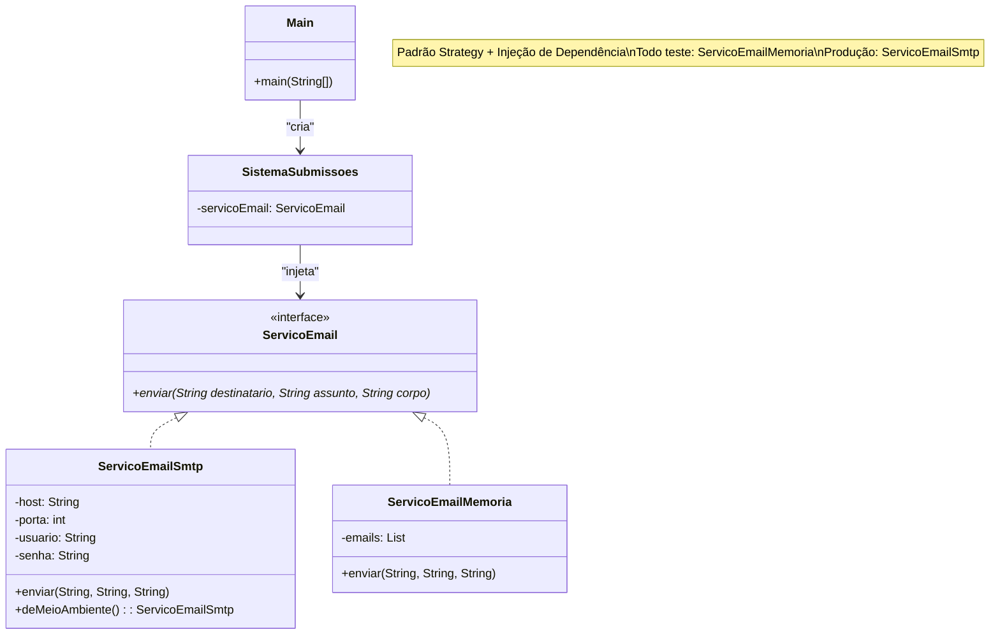

---

## 📦 Arquitetura em Camadas

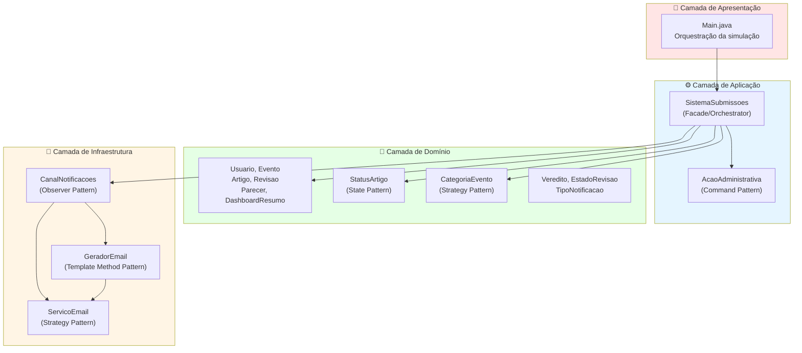

---

## 🔄 Fluxo de Distribuição Automática

Demonstra a lógica inteligente de afinidade e balanceamento de carga.

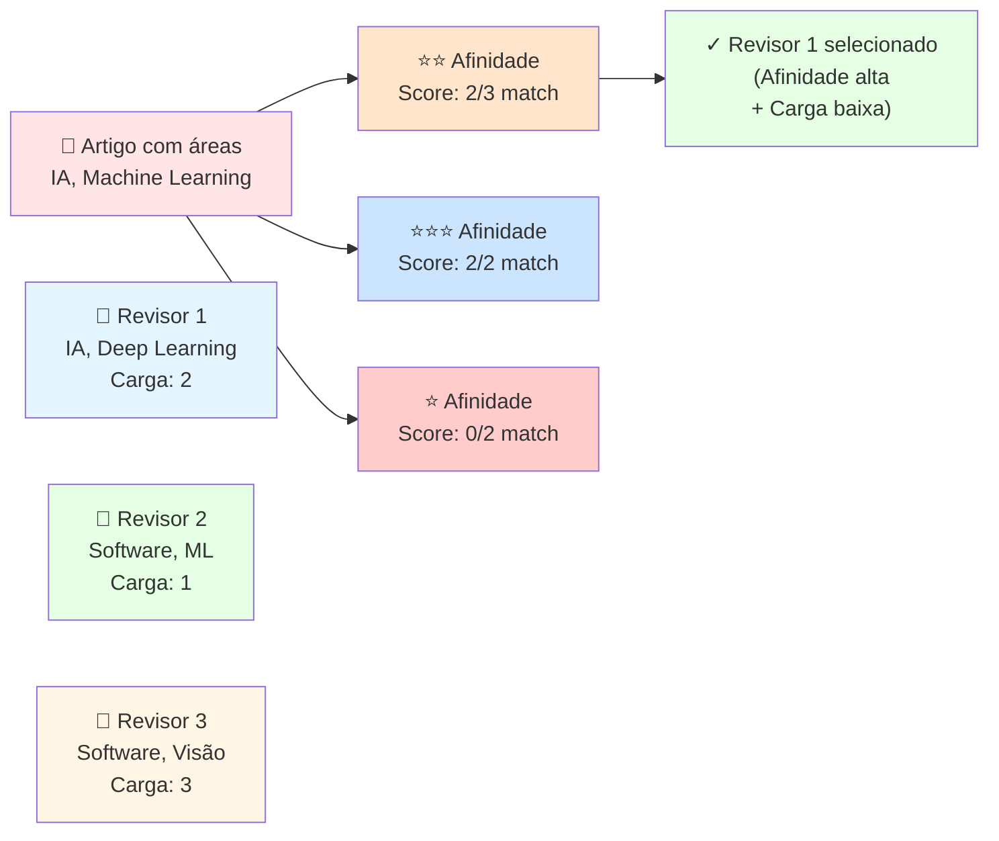

---

## 📊 Fluxo de Estados de Revisão

Estados internos da revisão durante o processo.

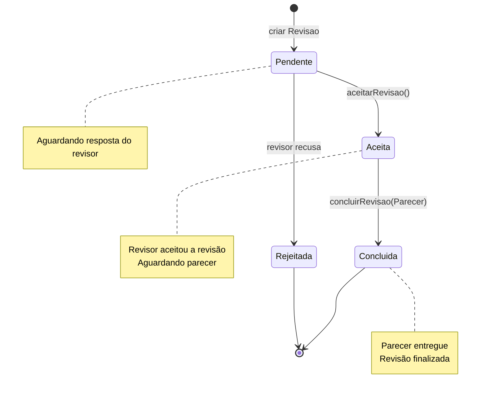

---

## 🎯 Matriz de Responsabilidades (RACI)

| Responsabilidade | SistemaSubmissoes | Usuario | Artigo | Revisao | CanalNotificacoes | ServicoEmail |
|---|:---:|:---:|:---:|:---:|:---:|:---:|
| Criar evento | **R** | - | - | - | - | - |
| Cadastrar usuário | **R** | **A** | - | - | - | - |
| Receber submissão | **R** | **A** | **C** | - | - | - |
| Validar prazo | **R** | - | **C** | - | - | - |
| Distribuir artigos | **R** | - | **C** | **A** | **I** | - |
| Aceitar revisão | **R** | **A** | - | **C** | - | - |
| Concluir revisão | **R** | **A** | **C** | **A** | **I** | - |
| Gerar parecer | - | **A** | **C** | **R** | - | - |
| Notificar | **R** | - | **C** | - | **A** | **C** |
| Enviar email | **R** | - | - | - | **C** | **A** |

**Legenda**: R=Responsável, A=Accountable, C=Consultado, I=Informado

---

## 📈 Sequência de Fluxo Principal

Mostra a sequência de chamadas no cenário completo.

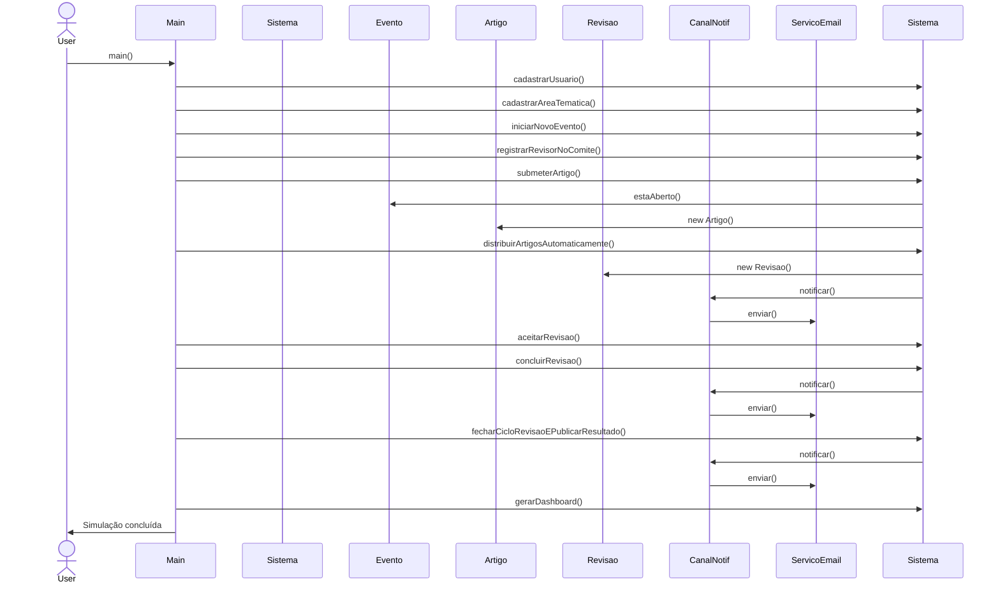

---

## 📋 Resumo de Padrões por Camada

| Camada | Padrão | Classe(s) | Benefício |
|--------|--------|-----------|-----------|
| **Aplicação** | Facade | SistemaSubmissoes | Interface unificada, encapsulamento |
| **Aplicação** | Command | AcaoAdministrativa | Operações encapsuladas, extensível |
| **Domínio** | State | StatusArtigo | Transições seguras, comportamento específico |
| **Domínio** | Strategy | CategoriaEvento | Flexibilidade, sem modificação |
| **Infraestrutura** | Strategy | ServicoEmail | Teste/Produção, extensível |
| **Infraestrutura** | Observer | CanalNotificacoes | Desacoplamento, 1:N |
| **Infraestrutura** | Template Method | GeradorEmail | Estrutura comum, customização |
| **Criação** | Builder | Artigo, Email | Construção validada, fluent API |

---

## 🧪 Cenários de Teste UML

### Teste 1: Distribuição com Afinidade
```
Artigo {IA, ML} --> Revisor {IA, ML, DL} ✅ (score 2/2)
                --> Revisor {SW, ML}    ✅ (score 1/2)
                --> Revisor {SW, VC}    ❌ (score 0/2, fallback)
```

### Teste 2: Balanceamento de Carga
```
Revisor A carga: 2 --> Recebe artigo (afinidade 2)
Revisor B carga: 3 --> Não recebe (carga alta)
Revisor C carga: 1 --> Recebe artigo (carga baixa)
```

### Teste 3: Conflito de Interesse
```
Artigo {Autor: Juan, Coautores: [Maria]}
  --> Revisor Juan  ❌ (é autor)
  --> Revisor Maria ❌ (é coautor)
  --> Revisor Pedro ✅ (sem conflito)
```

---

## 📚 Notação Usada

- **Interface** (<<interface>>) - contrato sem implementação
- **Abstract** (<<abstract>>) - classe base para herança
- **Enumeration** (<<enumeration>>) - tipos enumerados
- **→** Associação simples
- **→|** Herança (is-a)
- **--→** Dependência
- **◆--→** Composição (parte obrigatória)
- **○--→** Agregação (parte opcional)
- **\*--→** Multiplicidade (muitos)

---

**Última atualização**: 2026-07-01  
**Versão**: 1.0  
**Gerado com**: Mermaid Diagram Engine
